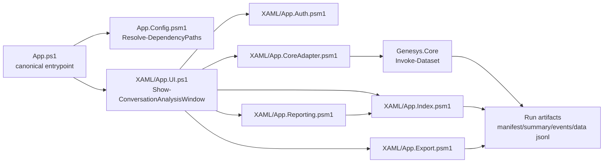

# Genesys Conversation Analysis (PowerShell + WPF)

Desktop analytics workbench for **Genesys Cloud conversation detail analysis** built in PowerShell/WPF, using **Genesys.Core** run artifacts for scalable paging, drilldown, and CSV export.

**Keywords:** genesys cloud, conversation analytics, powershell, wpf, desktop app, contact center analytics, run artifacts, jsonl, csv export, oauth client credentials, pkce, genesys.core, call quality, mos, queue analysis

---

## Why this exists

Genesys conversation-detail datasets can be large, and ad-hoc API querying is slow and hard to review repeatedly.
This project provides a local WPF UI to run and inspect analytics extractions while keeping extraction logic in `Genesys.Core`.
It focuses on artifact-driven workflows (`manifest.json`, `summary.json`, `events.jsonl`, `data/*.jsonl`) so you can reopen and analyze prior runs without re-querying APIs.

---

## Quickstart (first-time setup)

### 1. Prerequisites

- **Windows 10 or 11** (WPF desktop app)
- **PowerShell 7.2+** — install from [aka.ms/powershell](https://aka.ms/powershell)
- **Git** — to clone the repositories
- **Genesys Cloud OAuth client** — Client Credentials grant with analytics permissions:
  - `analytics:conversationDetail:view`
  - `analytics:conversationAggregate:view`

### 2. Clone repositories side-by-side

```powershell
# Create a root source directory (adjust path as needed)
New-Item -Path 'C:\Source' -ItemType Directory -Force
Set-Location 'C:\Source'

# Clone the Genesys.Core engine (required dependency)
git clone https://github.com/xfaith4/Genesys.Core .\Genesys.Core\

# Clone this application
git clone <this-repo-url> .\Genesys.Core.ConversationAnalytics\
```

Expected folder structure:

```text
C:\Source\
├── Genesys.Core\
│   └── modules\
│       ├── Genesys.Core\
│       │   └── Genesys.Core.psd1
│       └── Genesys.Auth\
│           └── Genesys.Auth.psd1
└── Genesys.Core.ConversationAnalytics\
    └── v.1.3.0\
        └── App.ps1          <- canonical entrypoint
```

### 3. Set environment variables

Set these in your PowerShell session (or add to your `$PROFILE` for persistence):

```powershell
# Module paths -- point to your Genesys.Core clone
$env:GENESYS_CORE_MODULE_PATH = 'C:\Source\Genesys.Core\modules\Genesys.Core\Genesys.Core.psd1'
$env:GENESYS_AUTH_MODULE_PATH = 'C:\Source\Genesys.Core\modules\Genesys.Auth\Genesys.Auth.psd1'

# Genesys Cloud credentials
$env:GENESYS_CLIENT_ID     = '<your-oauth-client-id>'
$env:GENESYS_CLIENT_SECRET = '<your-oauth-client-secret>'
$env:GENESYS_REGION        = 'usw2.pure.cloud'    # e.g. mypurecloud.com
```

### 4. Launch the app

```powershell
Set-Location 'C:\Source\Genesys.Core.ConversationAnalytics\v.1.3.0'

pwsh -NoProfile -ExecutionPolicy Bypass -File ./App.ps1
```

That's it. The WPF window opens. Click **Connect** to authenticate.

### 5. If auth or startup fails -- run the smoke test

```powershell
pwsh -NoProfile -File ./scripts/Invoke-Smoke.ps1 -Verbose
```

Expected output on success:

```text
[PASS] Imports
[PASS] Paths
[PASS] Auth env-vars
[PASS] Token acquisition
[PASS] XAML artefact
--- Smoke: PASS ---
```

Common fixes are printed inline when a check fails.

---

## Optional: Offline / demo mode

To launch the UI without credentials (artifact browsing only, no extraction):

```powershell
pwsh -NoProfile -File ./App.ps1 -Offline
# or:
$env:APP_OFFLINE = '1'; pwsh -NoProfile -File ./App.ps1
```

Offline mode skips dependency resolution, auth preflight, and Core initialization.

---

## Optional: appsettings.json (path config alternative to env vars)

Create `./appsettings.json` at the repo root to avoid setting env vars each session:

```json
{
  "GenesysCoreModulePath": "C:\\Source\\Genesys.Core\\modules\\Genesys.Core\\Genesys.Core.psd1",
  "GenesysAuthModulePath": "C:\\Source\\Genesys.Core\\modules\\Genesys.Auth\\Genesys.Auth.psd1"
}
```

Path resolution precedence (first valid `.psd1` wins):

1. CLI params: `-GenesysCoreModulePath` / `-GenesysAuthModulePath`
2. Env vars: `GENESYS_CORE_MODULE_PATH` / `GENESYS_AUTH_MODULE_PATH`
3. `./appsettings.json`
4. Auto-detect: `./modules/Genesys.Core/Genesys.Core.psd1`

---

## Usage

Typical workflow:

1. Launch: `pwsh -NoProfile -File ./App.ps1`
2. Click **Connect** (reads `GENESYS_CLIENT_ID` / `GENESYS_CLIENT_SECRET` / `GENESYS_REGION`).
3. Set date range and optional filters (direction / media / queue).
4. Click **Preview Run** or **Full Run**.
5. Inspect results in **Conversations**, drilldown in **Drilldown**, export CSV.
6. Open a previous run folder with **Open Run** -- no re-query needed.

---

## Environment variables reference

| Variable | Required | Format | Description |
|---|---|---|---|
| `GENESYS_CORE_MODULE_PATH` | Yes | Absolute path to `.psd1` | Points to `Genesys.Core.psd1` |
| `GENESYS_AUTH_MODULE_PATH` | Yes | Absolute path to `.psd1` | Points to `Genesys.Auth.psd1` |
| `GENESYS_CLIENT_ID` | Yes (Client Creds) | UUID | Genesys Cloud OAuth client ID |
| `GENESYS_CLIENT_SECRET` | Yes (Client Creds) | Secret string | Genesys Cloud OAuth client secret |
| `GENESYS_REGION` | Yes (Client Creds) | e.g. `usw2.pure.cloud` | Genesys Cloud region hostname |
| `GENESYS_AUTH_MODE` | No | `client_credentials` or `pkce` or `bearer` | Auth flow; defaults to `client_credentials` |
| `GENESYS_CORE_CATALOG_PATH` | No | Absolute path | Override derived catalog path |
| `GENESYS_CORE_SCHEMA_PATH` | No | Absolute path | Override derived schema path |
| `APP_OFFLINE` | No | `1` | Set to `1` to launch in offline/demo mode |

---

## Configuration file

Persisted user settings (page size, region, recent runs, date range) are stored at
`%LOCALAPPDATA%\GenesysConversationAnalysis\config.json`.
This is separate from `appsettings.json` (which holds module paths for the launcher).

---

## CLI commands

```powershell
# Launch app (canonical -- only supported entrypoint)
pwsh -NoProfile -ExecutionPolicy Bypass -File ./App.ps1

# Launch with explicit module paths (overrides env vars and appsettings.json)
pwsh -NoProfile -File ./App.ps1 `
    -GenesysCoreModulePath 'C:\Source\Genesys.Core\modules\Genesys.Core\Genesys.Core.psd1' `
    -GenesysAuthModulePath 'C:\Source\Genesys.Core\modules\Genesys.Auth\Genesys.Auth.psd1'

# Launch in offline mode (no credentials needed)
pwsh -NoProfile -File ./App.ps1 -Offline

# Run smoke test (full diagnostics)
pwsh -NoProfile -File ./scripts/Invoke-Smoke.ps1 -Verbose

# Run smoke test offline (import + XAML checks only)
pwsh -NoProfile -File ./scripts/Invoke-Smoke.ps1 -Offline

# Run compliance checks (architecture guardrails)
pwsh -NoProfile -File ./XAML/Invoke-AppCompliance.ps1
```

---

## Key features

- WPF desktop UI with run controls, paging, drilldown tabs, and run console ([XAML/MainWindow.xaml](XAML/MainWindow.xaml))
- Delegated extraction via `Invoke-Dataset` through a Core adapter seam ([XAML/App.CoreAdapter.psm1](XAML/App.CoreAdapter.psm1))
- Background run execution with job polling and live artifact/status updates ([XAML/App.UI.ps1](XAML/App.UI.ps1))
- Local run indexing (`index.jsonl`) for fast page loading and record lookup ([XAML/App.Index.psm1](XAML/App.Index.psm1))
- Run-level and page-level export paths, including streaming full-run CSV export ([XAML/App.Export.psm1](XAML/App.Export.psm1))
- Impact reporting over filtered index data (division/queue/agent rollups) ([XAML/App.Reporting.psm1](XAML/App.Reporting.psm1))
- Compliance gate script to detect forbidden direct API usage and module-boundary violations ([XAML/Invoke-AppCompliance.ps1](XAML/Invoke-AppCompliance.ps1))
- Day-one smoke test for readiness verification ([scripts/Invoke-Smoke.ps1](scripts/Invoke-Smoke.ps1))

---

## Architecture



### Repository layout

```text
./
+-- App.ps1                          <- CANONICAL ENTRYPOINT
+-- App.Config.psm1                  <- Config, Resolve-DependencyPaths, Invoke-AuthPreflight
+-- appsettings.json                 <- (optional) repo-local module path config
+-- scripts/
|   +-- Invoke-Smoke.ps1             <- Day-one smoke/readiness test
+-- XAML/
    +-- MainWindow.xaml              <- WPF UI layout
    +-- App.UI.ps1                   <- UI orchestration and event handlers
    +-- App.Auth.psm1                <- Auth wrapper for Genesys.Auth
    +-- App.CoreAdapter.psm1         <- Only Core integration seam (Gate D)
    +-- App.Index.psm1               <- Run indexing and paging
    +-- App.Export.psm1              <- CSV export
    +-- App.Reporting.psm1           <- Impact report generation
    +-- Invoke-AppCompliance.ps1     <- Architecture compliance checks
    +-- Run-ConversationAnalytics.ps1 <- [DEPRECATED] use ./App.ps1
    +-- ENGINEER_QUICKSTART.md       <- Step-by-step setup guide
    +-- Architecture.md              <- Design principles
```

> **Deprecated:** `XAML/Run-ConversationAnalytics.ps1` is a backwards-compatibility shim
> that forwards to `App.ps1` with a deprecation warning. Do not use it for new workflows.
> It will be removed in a future release.

---

## Development

No build system or CI workflow is currently defined.

Useful commands:

```powershell
# Syntax/load sanity checks
Import-Module ./App.Config.psm1 -Force
Import-Module ./XAML/App.Auth.psm1 -Force
Import-Module ./XAML/App.CoreAdapter.psm1 -Force
Import-Module ./XAML/App.Index.psm1 -Force
Import-Module ./XAML/App.Export.psm1 -Force
Import-Module ./XAML/App.Reporting.psm1 -Force

# Full readiness test
pwsh -NoProfile -File ./scripts/Invoke-Smoke.ps1 -Verbose

# Architecture/compliance checks
pwsh -NoProfile -File ./XAML/Invoke-AppCompliance.ps1
```

Local dev tips:

- Keep `Genesys.Core` checked out nearby. Update `GENESYS_CORE_MODULE_PATH` when switching Core branches.
- Run artifacts are the source of truth for paging/export/reporting; keep sample run folders for offline UI testing.
- Use `-Offline` to iterate on UI layout without needing credentials.

---

## Requirements

- Windows 10/11 (WPF desktop app)
- PowerShell 7.2+ on Windows (recommended; 5.1 is the minimum per `#Requires`)
- Genesys.Core cloned separately (module path must be resolvable)
- Genesys Cloud OAuth client credentials with analytics permissions

---

## Ideas / Next steps

- Add CI workflow to run compliance and smoke tests on every PR.
- Add `LICENSE`, `CONTRIBUTING.md`, and `SECURITY.md`.
- Pin and document minimum compatible `Genesys.Core` version.
- Add screenshots/GIFs under `./docs/assets/` and reference them in Usage.
- Automated tests for `App.Index.psm1` and `App.Export.psm1` against sample artifacts.

---

## Contributing

Until `CONTRIBUTING.md` is present:

1. Open an issue describing bug/feature scope.
2. Keep Core-boundary rules intact (`Genesys.Core` only through the adapter).
3. Run `pwsh -NoProfile -File ./XAML/Invoke-AppCompliance.ps1` before submitting a PR.
4. Include reproduction steps and sample run-artifact context for UI/data issues.

---

## Security

No `SECURITY.md` yet. If you find a vulnerability, please report privately to repository maintainers rather than opening a public issue.

---

## License

License: **TBD** (no `LICENSE` file present).
